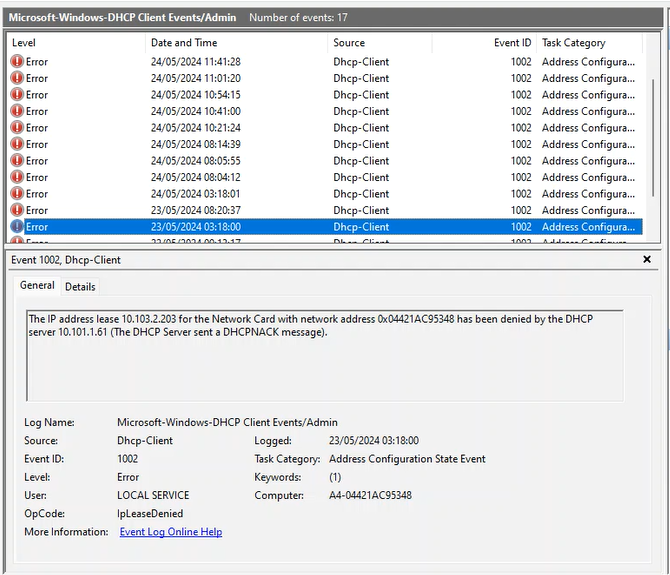

## Description

- Find all devices that are on the network and transfer them to the AV VLAN of 10.103.2.xx
- Add Crestron devices to XiO Cloud and track programs
- Find access to QSC devices
- Find all sennheiser microphones and put them on the network
- Add screens to XiO cloud
- Enable screens to power on and off when room not in use
	- Buy crestron HD-CTL-101 for flex screens that don't have this feature

- See also:
	- [SSG123-Networking](SSG123-Networking.md)
	- [YS26-Networking](../../04-Archive/Completed/YS26-Networking.md)
	- [KPL-Networking](../../04-Archive/Completed/KPL-Networking.md)

## Task List

- [x] [Network all screens](../../04-Archive/Completed/Networking-Screens-121.md)
- [ ] Network all Sennheiser Microphones
- [ ] Put all devices on VLAN
	- Screens
	- Flex
	- Sennheiser

## Room List
- Radiology TR Room - Ground Floor
- Kiran Pathak lab
- 302 Meeting room 
- 301 Meeting room 
- 101 Meeting Room
- 401 Meeting Room
- G01 Meeting Room

---

## Flex Devices

Room    | Device       | IP           | MAC 
------- | ------------ | ------------ | ----------------- 
MR 1-01 | Flex NUC     | 10.2.176.68  | 04:42:1A:C9:58:FE 
MR 1-01 | Flex Mercury | 10.2.176.154 | c4:42:68:10:9e:13 
MR 3-01 | Flex NUC     | 10.2.176.54  | 7C:10:C9:B8:F7:EF 
MR 3-01 | Flex Mercury | 10.2.176.73  | C4:42:68:10:97:C7 
MR 3-02 | Flex NUC     | 10.2.176.66  | 04:42:1A:C9:52:DE 
MR 3-02 | Flex Mercury | 10.2.176.135 | C4:42:68:10:97:73 
MR 4-01 | Flex NUC     | 10.2.176.57  | 04:42:1A:C9:53:48 
MR 4-01 | Flex Mercury | 10.2.176.137 | C4:42:68:10:98:88 
MR G-01 | Flex NUC     | 10.2.176.115 | 04:42:1A:C9:C0:D5 
MR G-01 | Flex Mercury | 10.2.176.118 | 00:10:7F:ED:29:9E 

## Screens

Room   | Device          | IP            | MAC 
------ | --------------- | ------------- | -----------------
MR 101 | SONY FW-65BZ40H | 10.2.176.64   | 88:c9:e8:0d:48:aa
MR 101 | SONY FW-65BZ40H | 10.2.176.65   | 88:c9:e8:0d:48:61
MR 302 | SONY FW-65BZ40H | 10.2.176.67   | 88:c9:e8:0d:48:99
MR 302 | SONY FW-65BZ40H | 10.2.176.144  | 88:c9:e8:0d:47:f7
MR 401 | SONY FW-65BZ40H | 10.2.176.55   | 88:c9:e8:0d:48:a8
MR 401 | SONY FW-65BZ40H | 10.2.176.128  | 88:c9:e8:0d:48:98

## Other
Room    | Device       | IP           | MAC 
------- | ------------ | ------------ | ----------------- 
MR 3-01 | HD-CTL-101   | 10.2.176.207 | c4:42:68:2f:b1:6e

---

### Problem Migrating UC-Engines to VLAN

- When the uc-engines migrated to the VLAN, they had an issue every morning after the nightly reboot and I imitated the problem multiple times through rebooting manually. IT didn't happen for every manual reboot, but every 2nd, 3rd or 4th time.
- It appears from the log files that the DHCP server was refusing the IP that was being requested.
- There were logs of the uc-engine requesting both it's old 10.2.176.x IP and 10.103.2.x IP. Perhaps this contributed to the problem.
- If so, perhaps performing the following may be necessary:
	```powershell
	ipconfig /release
	
	or
	
	ipconfig /renew
	```

### DHCP-Client Log File


---

###### Resources

