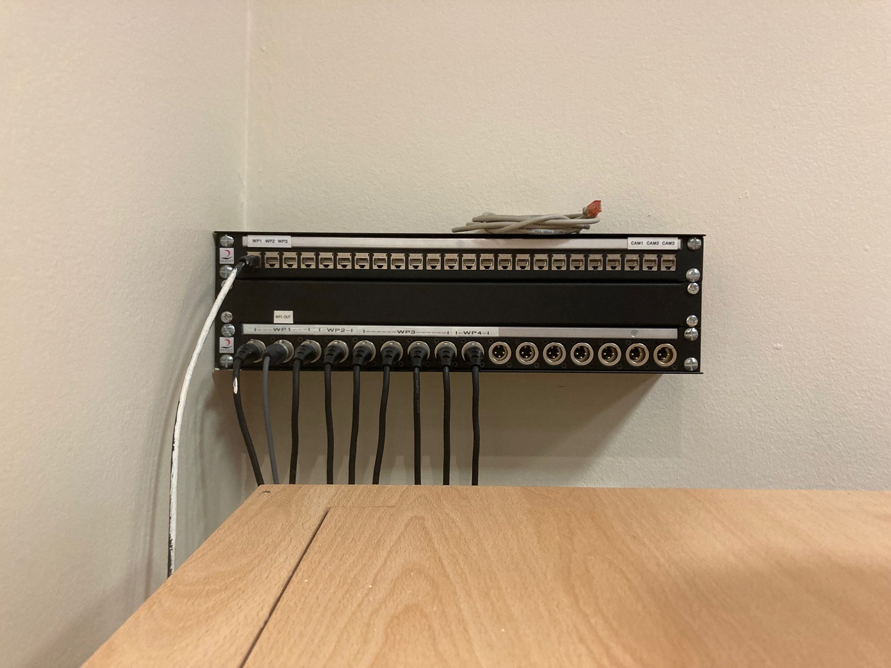
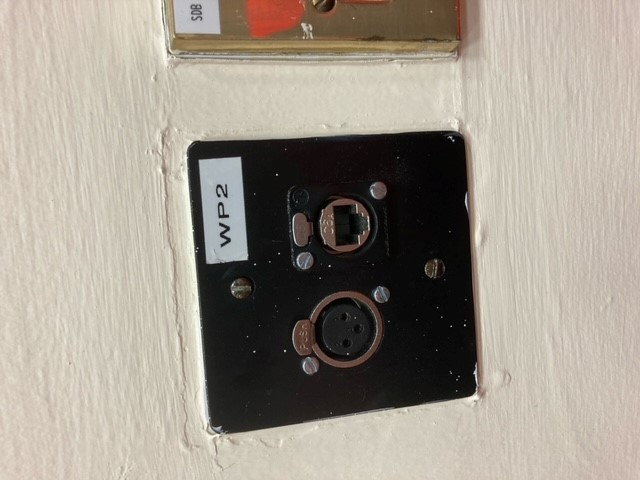
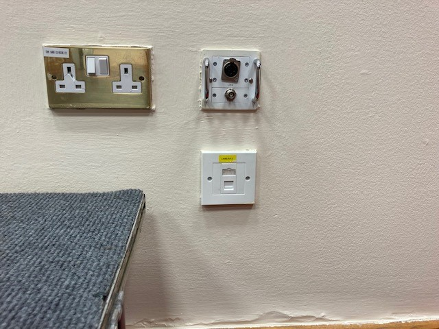
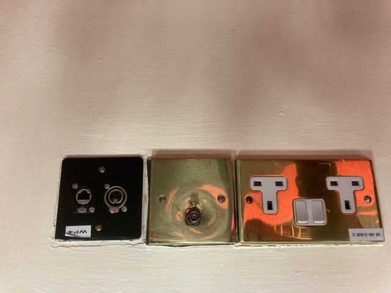

## Tasks

- [x] Ask Estates to install cabling
	- Completed by Ian
- [x] Terminate Camera SDI cables
- [x] Terminate Cat6 Cables
- [ ] Install and terminate spare SDI/Cat6 box
- [ ] Change IP Address to AV VLAN
- [ ] Change Sennheiser IP addresses to AV VLAN
- [ ] Debug camera issue - No Content Showing

## Information

- Due to booking cancellations and issues arranging time for an installer to complete the work, we decided to complete the work ourselves with the help if estates to install the cabling.

- [SSG123-Exam-Hall](../03-Resources/Rooms/SSG123-Exam-Hall.md)
- [Aver PTZ330 Manual]

---
###### Reference Links
[Aver PTZ330 Manual]: https://www.averusa.com/pro-av/downloads/user-manual/PTZ310,330,310N,330N%20UM_20200316.pdf

- [Exam Hall list of works.docx](https://rcsicampus-my.sharepoint.com/:w:/r/personal/owenmccarthy_rcsi_com/Documents/Archive/Exam%20Hall%20list%20of%20works.docx?d=w5fd95ffa6ad24740a4a457dfd8c9872b&csf=1&web=1&e=W8wEJT)

- [Exam-Hall-Stage-Box-Pics](https://rcsicampus-my.sharepoint.com/:f:/r/personal/owenmccarthy_rcsi_com/Documents/Archive/Exam-Hall-Stage-Box-Pics?csf=1&web=1&e=vhMNCt)

---

## List of works to be completed

### Cameras

- Provide and run HD-SDI cable from camera to wall box
- Terminate SDI cable to camera and inside wall box at cabinet
- Supply 1U panel for wall box with 6 SDI connectors and blanks for other ports of panel
- 3 SDI for camera
- 3 SDI for wall plates
- 

- Connect 3 Camera SDI ports to black magic box (SDI – HDMI) in the rack.
- Supply 1U panel for cabinet rack with 3 HDMI ports (can be HDMI back to back). Fed from black magic boxes.
- Cat6 cable for camera is in place, on top of wooden surround. This may need to be extended down to camera position. I’m unsure whether it is terminated with a male or female connector.
- Cameras to be installed at bottom of wooden surround, upside down, at same level as audio speakers.
- Cameras and controller to be connected to college network and configured for use. Ports or switch will be provided.
- I can provide a Roland VR50HD switcher for testing of camera signals and controller during install, if you wish.

##### Ports On Wall
- Supply 3 Wall plates with SDI connector
- My preference would be for wall plates in style of below pic

### Wall plates can replace current wall plates. Pics below

##### Wall Plate 1 – current plate is not in use

##### Wall Plate 2 – current plate is not in use

##### Wall Plate 3

- My preference for this wall plate rather than add another single gang plate beside it, would be to replace this with a 2 port single gang like in the picture above and re-terminate the cat6 to an ethercon and add SDI connector.

