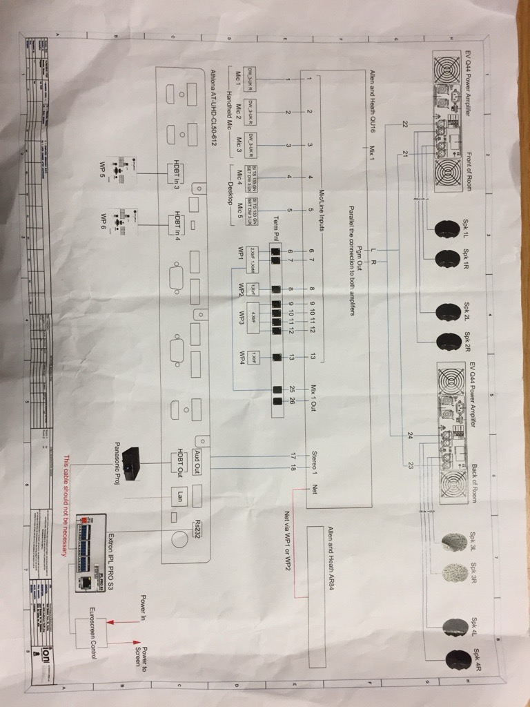

## Description

- Convert Exam Hall to crestron control system
- Get projector control via XiO scheduling
- Create XPanel and program with scheduling

## Task List

- [ ] Investigate visual switching needs in room
- [ ] Investigate cabling to projector
- [ ] Investigate cabling to touchpanels

## Equipment

- Do I need a CEN-IO up at the projector? 
- Do I have enough RS232 ports?

###### Control
- Projection Screen - Relay
- Atlona Switcher - RS232
- Projector - RS232
- TSW 770 Touchpanels - Ethernet
- AVER PTZ 330 Cameras - Ethernet

###### Signal
- Projector (Cat6?)

## Purchases

- RMC4 Controller
- 7 inch touchpanl x2 (in stock)
- DM Receiver

---

###### Resources
[Crestron Equipment_Rev1-Quote with products and scope.pdf](https://rcsicampus-my.sharepoint.com/:b:/r/personal/owenmccarthy_rcsi_com/Documents/Archive/Crestron%20Equipment_Rev1-Quote%20with%20products%20and%20scope.pdf?csf=1&web=1&e=5er3Sm)

[Aver-PTZ330](../03-Resources/Equipment/Aver-PTZ330.md)

[Exam-Hall](../03-Resources/Rooms/Exam-Hall.md)

- 