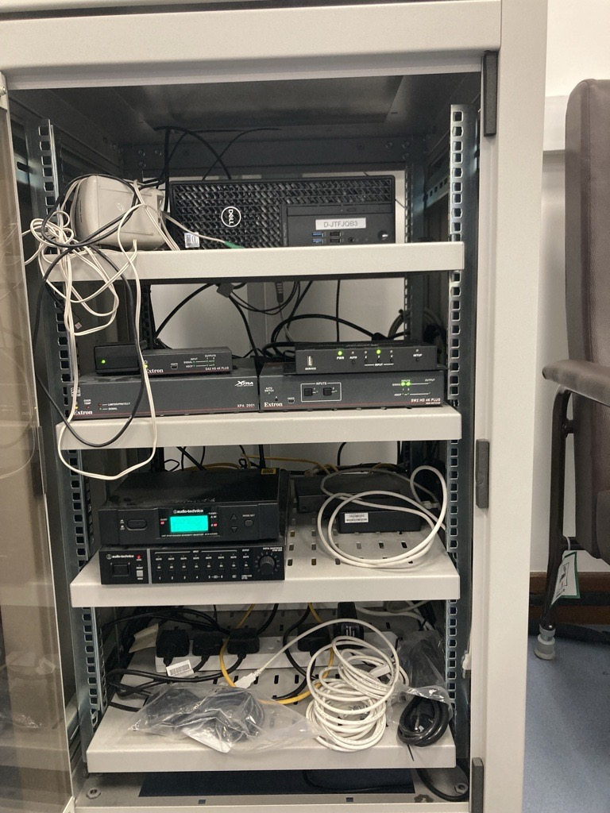
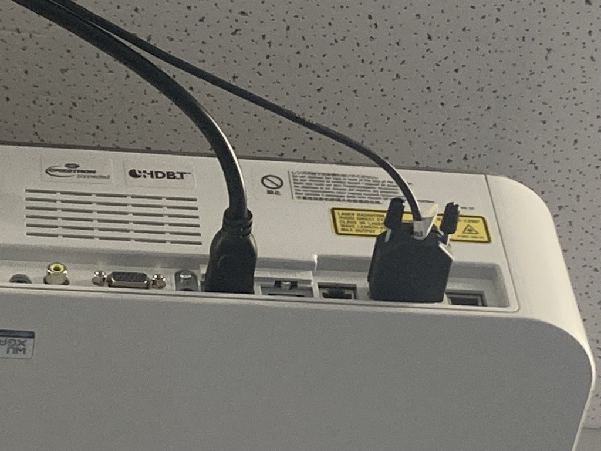

 
## Description

Install new switching system in physio movement lab. The current system is extremely prone to errors and communication problems between switchers and the button panel.

I plan to replace the two switcher system with a single dual output DMPS3.

## Program Notes

- Same user interface as everywhere else
- 2 camera switch for control
- Cameras should always switch capture card and screen.
- Pc inputs should only switch screens, not capture card.
- Mic audio should always be routed to capture card.

## Task List

- [ ] Set up test rig with AP3 and Wireless Touchpanel
	- Install battery in touchpanel
	- Set up CEN-GWEXER
- [ ] Create Schematic
- [ ] Create Program
	- [ ] User Interface
	- [ ] Web XPanel
- [ ] Install new equipment

## Purchases

- [x] Buy battery for Wireless Touchpanel TST-902
- [x] Buy wireless CEN-GWEXER

###### Quotes & PO
- [Crestron Equipment_Rev1-Quote with products and scope.pdf](https://rcsicampus-my.sharepoint.com/:b:/r/personal/owenmccarthy_rcsi_com/Documents/Archive/Crestron%20Equipment_Rev1-Quote%20with%20products%20and%20scope.pdf?csf=1&web=1&e=GPoQ2a)
- [po-TST902-CEN-GWEXER](https://rcsicampus-my.sharepoint.com/:b:/r/personal/owenmccarthy_rcsi_com/Documents/Archive/po-ExamHall-RMC4.pdf?csf=1&web=1&e=zfsnpx)

## Cabling
- Can We run new rs232/network cabling?

---

## Information
 
 Function           | Device      | Communication
 ------------------ | ----------- | ------------------------
 Processor/Switcher | DMPS3 250   | Network
 Button Panel       | MPC3 Button | Network
 Touch Panel        | TS 990      | Network via wireless box 
 Wireless Box       | CEN         | Network
 Projector          | Sony?       | RS232 Driver
 Displays           |             |
 Cameras            | Telecam     |
 Audio Capture      |             |
 Video Capture      |             |

|  |
| -- | -- |
| DMPS Routing |
| Output 1 | 
| Output 2 |
| Input 1 |
| Input 2 |
| Input 3 |
| Input 4 |
| Com 1 |
| Com 2 |

---

## Pictures

- 
	- [Link](../04-Archive/Attachments/Physio-Movement-Rack.jpg)
- 
	- [Link](../04-Archive/Attachments/Physio-Movement-Projector.jpg)