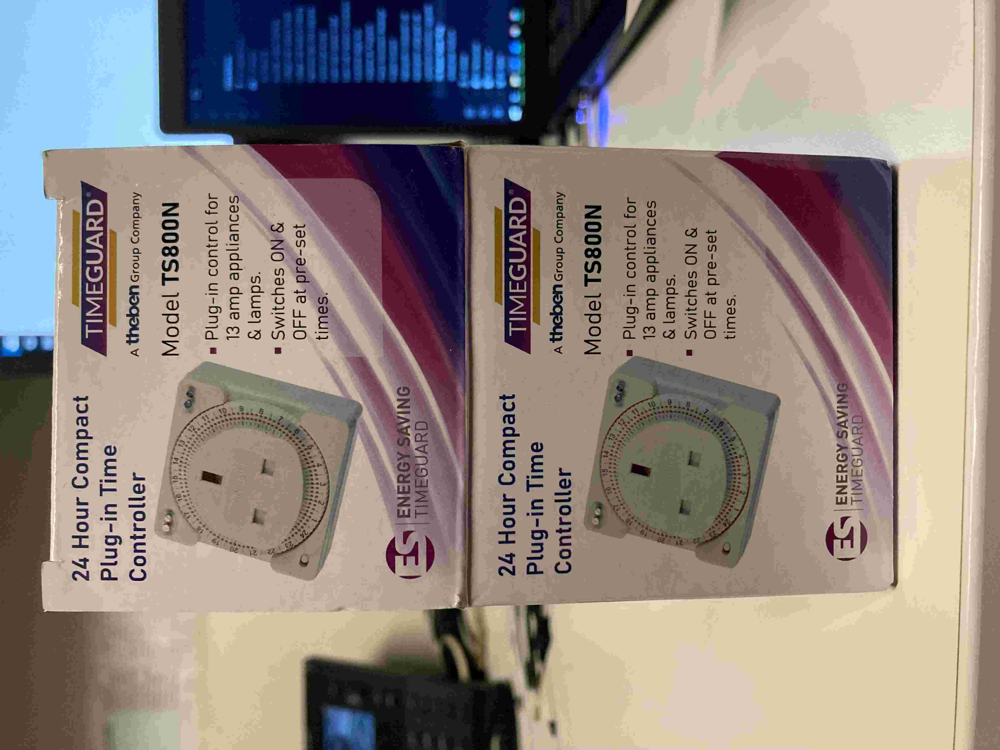
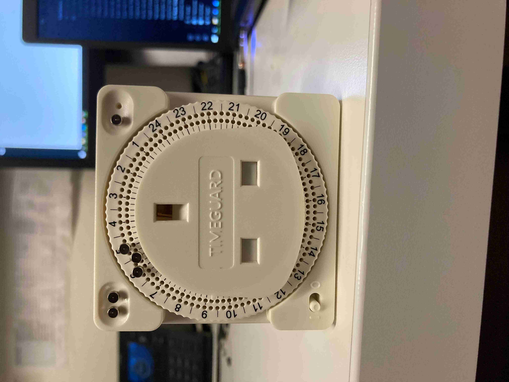
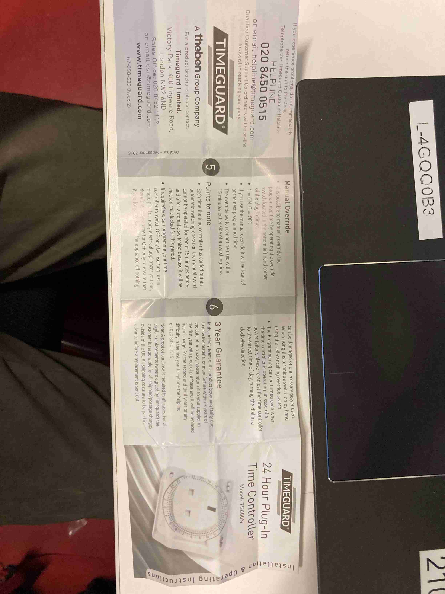

> [!NOTE]
> - Estates contacted to replace 2 pin plugs. Billy TODO
> - Spoke to Billy, gave him 12 3 pin plugs

## Description

- Install a timer socket on the screen in each TR Room.
- Replace 2 pin plugs with 3 pin plugs on screens.

###### Purpose
- Power cycle the screens each night to try to prevent HDMI/RS232 issues

---

## Task List

- [ ] Get estates to replace 2 pin plugs with 3 pin plugs.
	- [x] Contact estates by email
	- [ ] Billy to complete job
- [ ] Place Timer on the screen plug in each room
- [ ] Bring Small Ladder 
	- Check for and remove any unnecessary cabling behind screens
	- Use clips to tidy cabling

---
## Information

- In case of power failure, time will need to be reset
- Manual overide will not work 15 mins wither side of programmed time

- 
- 
- 
- 

###### Resources
- [Link to Timer](https://ie.rs-online.com/web/p/plug-in-timers/1716224?gb=s)
- [TR-Rooms-26YS](../03-Resources/Rooms/TR-Rooms-26YS.md)