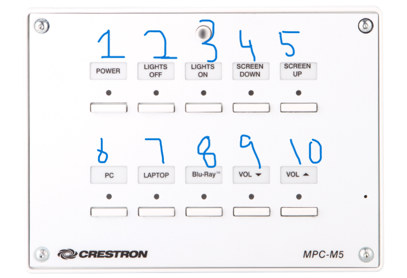

## Guide: Cameras in TR4 & TR5

==Enter Cam Control Mode==
- Hold Button 1 for 10 seconds
- Buttons start flashing when "Cam Control Mode" is enabled

==Save Preset==
- hold preset button for 5s

==Exit Cam Control Mode==
- Hold button 1 (On Button) for 5 seconds
- This happens automatically after 5 minutes

---

###### Camera Control Mode Button Functions

Button     | Function
---------- | ---------
Button 1   | Exit Cam Control (hold 5s)
Button 2   | Zoom In
Button 3   | Tilt Up
Button 4   | Pan Right
Button 5   | Preset 1
Button 6   | 
Button 7   | Zoom Out
Button 8   | Tilt Down
Button 9   | Pan Left
Button 10  | Preset 2

<!--

-->