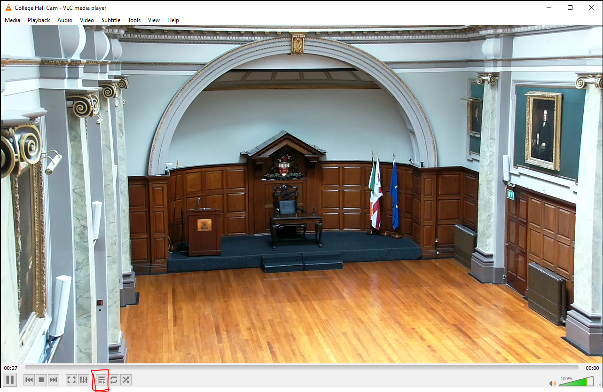
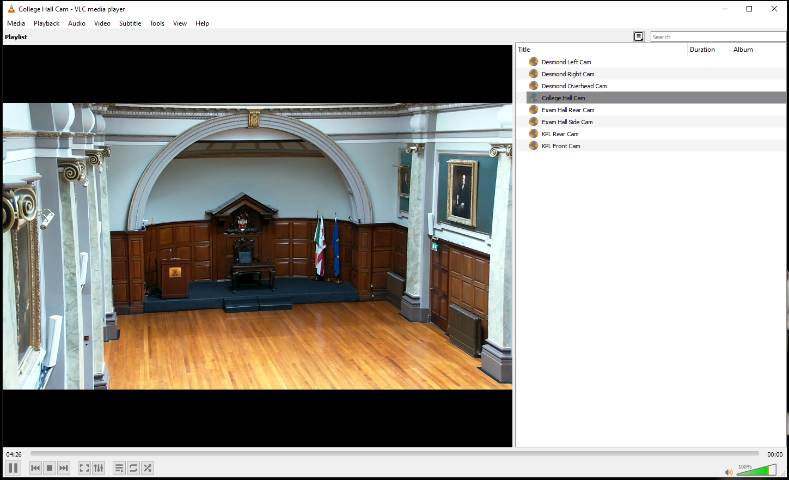

# Viewing Cameras

> [!CAUTION]
> With some cameras, only one person can view the backend camera stream at a time. Using the RTSP stream gets around this issue and allows you to keep a playlist with all cameras

---

## Create VLC Playlist

- Open VLC
- Select "Media" -> "Open Network Stream"
- Enter camera RTSP address ([as below](#Camera%20Stream%20Addresses))
- Add to this playlist by adding other streams
- Save the playlist. Select "Media" --> "Save Playlist to file"
- You can now open this file with all your streams saved.

---

## RTSP Stream Via VLC
[Link to playlist File](../../04-Archive/Attachments/RCSI%20Cameras.xspf)

- Open VLC Playlist file (.xspf)
- If camera opens fullscreen like below, select playlist button, circled red
- 
- This will reveal the other camera streams contained in the playlist, as below
- 
- Alternatively select "View" --> "Playlist"

---

## Camera Stream Addresses Examples

```
Aver                     | rtsp://10.2.120.72/live_st1
Telycam                  | rtsp://10.2.176.220:554/stream/sub
Panasonic AWHE40         | rtsp://10.103.2.119:554/mediainput/h264/stream_2
```

See individual camera manuals for more information.