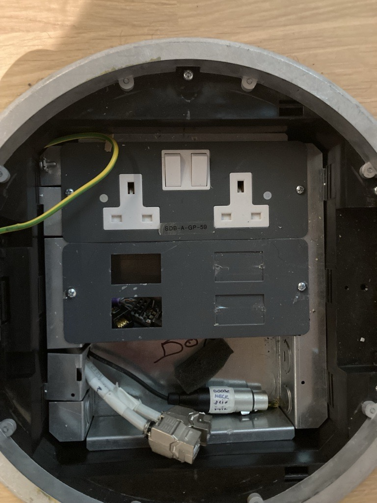

## Other-Devices

Device           | IP           | MAC 
---------------- | ------------ | ----------------- 
Panasonic AWHE40 | 10.103.2.117 | 20:C6:EB:EF:76:a2
Panasonic AWHE40 | 10.103.2.119 | 20:C6:EB:EF:7B:ea
Panasonic AWHE40 | 10.103.2.120 | 20:C6:EB:EF:76:a3
Panasonic AWRP50 | 10.103.2.254 | a8:13:74:77:4f:db
Extron MGP 462   | 10.103.2.113 | 00:05:a6:10:3C:7b
Q-Sys Core 110f  | 10.103.2.203 | 00:60:74:F7:F9:06

---

## Stage Box Wiring

Heading          | Description
---------------- | -----------------

## Jobs

- [Desmond-QSC-DM-Upgrade](../../04-Archive/Complete/Desmond-QSC-DM-Upgrade.md)
- [Desmond-Stage-Box](../../04-Archive/Complete/Desmond-Stage-Box.md)
- [Desmond-Reprogramming](../../04-Archive/Complete/Desmond-Reprogramming.md)
- [HTML5-XPanels](../../04-Archive/Complete/HTML5-XPanels.md)
- [Desmond-Foldback-Monitors](../../01-Projects/Desmond-Foldback-Monitors.md)

###### Resources

Small Lectern Floor Box
- 