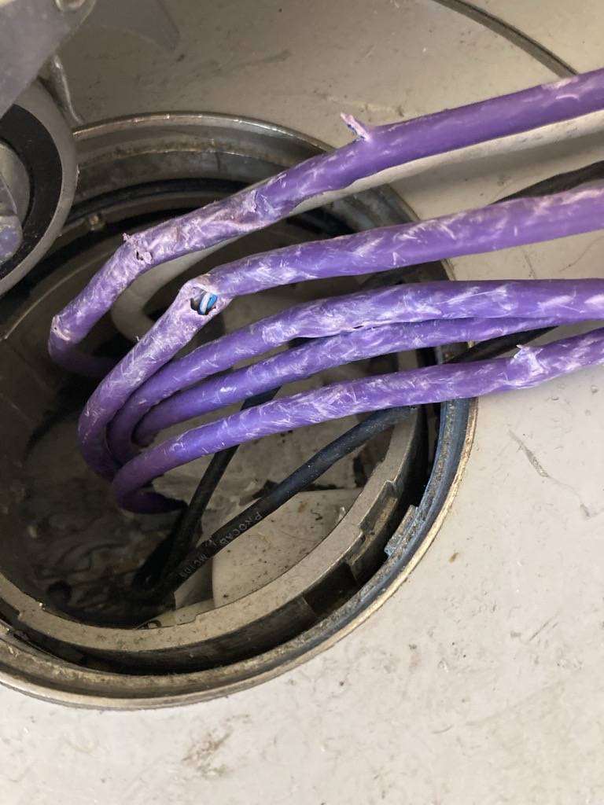

## Description

- Install stage box under the floor to replace and prevent broken cables
- Cables getting damaged by podium movement

## Task List

- [x] Build Stage Box
	- Cat6 connector is a back to back, angled Cat6 Cables in basement
	- Solder Female XLR port to male XLR head
- [x] Install stage box in floor
	- [x] Terminate Cat6 cables in floor with female Cat6 heads

## Purchases
- [x] Stage box
	- https://www.thomann.de/ie/cae_stagebox_8.htm
- [x] Cat6 Connectors for stage box
- [x] XLR Connectors for stage box
- [x] Cat6 Female connectors for installed cables
- [x] Angles cat6 cables for tails

## Information

---
###### Resources
- [YS26-Mutchnik-Lab-302](../../03-Resources/Rooms/YS26-Mutchnik-Lab-302.md)