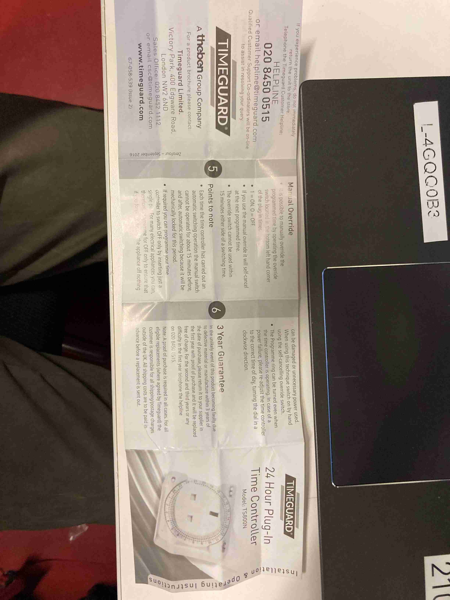

## Description

- Install a timer socket on the screen in each TR Room.
- Replace 2 pin plugs with 3 pin plugs on screens.

###### Purpose
- Power cycle the screens each night to try to prevent HDMI/RS232 issues

---

## Task List

- [x] Get estates to replace 2 pin plugs with 3 pin plugs.
	- [x] Contact estates by email
	- [x] Billy to complete job
- [x] Place Timer on the screen plug in each room
- [x] Bring Small Ladder 
	- Check for and remove any unnecessary cabling behind screens
	- Use clips to tidy cabling

---
## Information

- In case of power failure, time will need to be reset
- Manual overide will not work 15 mins wither side of programmed time

- 
- 
- 
- 

###### Resources
- [Link to Timer](https://ie.rs-online.com/web/p/plug-in-timers/1716224?gb=s)
- [YS26-TR-Rooms](../../03-Resources/Rooms/YS26-TR-Rooms.md)