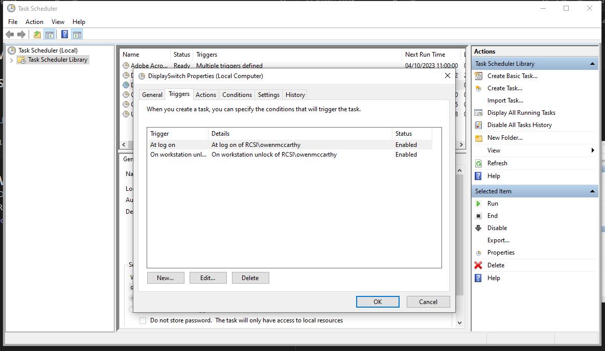

# Automate-Duplicate-Display

## Description

 Set up windows so that it will automatically trigger "Duplicate Display" when a user logs in or unlocks the PC.
 
---

## Resolution #1 - Windows Scheduler

- Open Windows Task Scheduler
- Right Click Task Scheduler Library and select "Create Task"
- Fill in as follows:
	- 
	- 
	- 
---

## Resolution #2 - Script
>[!NOTE]
>  This method creates a .bat file that is clickable.  This `.bat` file can be triggered from windows scheduler.
>  
>  We will also create a shortcut to this `.bat` file to hide the file and to change the icon. I used to do this to put a button on the taskbar or desktop.

- Create a new `.txt` file and name it `DisplaySwitch.txt`
- Open the `DisplaySwitch.txt` file with `notepad.exe`
- Copy and paste the following into the file:
	```
	display /clone
	```
- Save and close the file
- Right click the file and rename it from `DisplaySwitch.txt` to `DisplaySwitch.bat`

>[!TIP] 
> You have now created an executable `.bat` file. Double click the file to duplicate the displays! Now lets create the shortcut.
- Put this file in a discreet location on the PC
- Right click the `DisplaySwitch.bat` file and select `Create Shortcut`
- Once the shortcut is create, you can right click the file and select `Properties`
- You can customize the icon from within here

---
###### Reference Links
[1]: https://www.windowscentral.com/how-create-and-run-batch-file-windows-10
[2]: https://superuser.com/questions/394601/change-display-arrangement-via-batch-command-line-on-windows-7
[3]: https://www.sevenforums.com/tutorials/37625-display-switch-shortcut-create.html
[4]: https://sid-500.com/2019/02/12/windows-10-changing-the-default-projector-settings-with-displayswitch-exe-duplicate-extend/