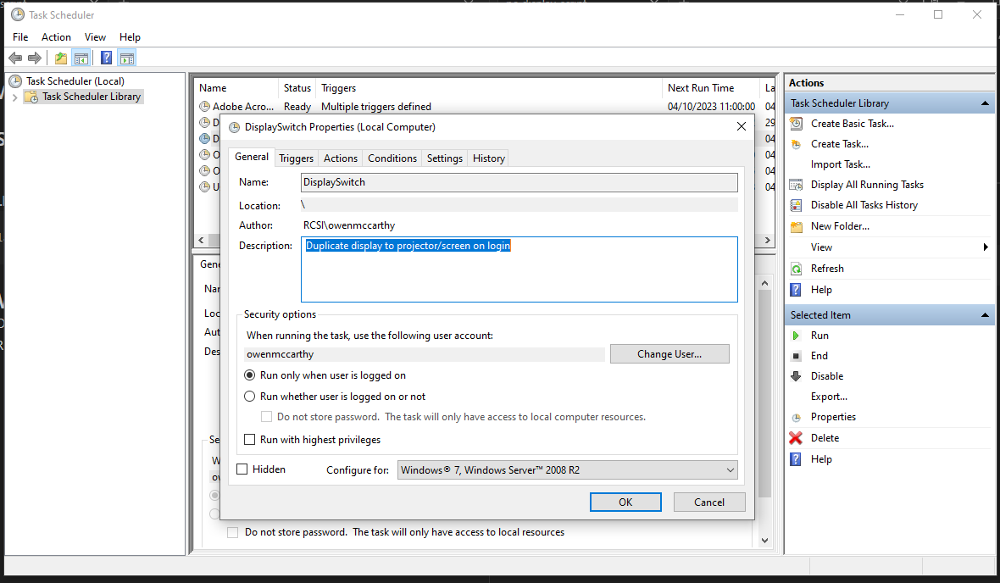

# Automate Win+P

> [!CAUTION]
> XiO Cloud settings take precedence over local settings. [XiO Cloud Help](../2.%20Information/Crestron%20OLH%20Links.md#XiO%20Cloud)

#### Description
> Issue Description

---

### Resolution
```
- Open Windows Task Scheduler
- Right Click Task Scheduler Library and select "Create Task"
- Fill in as follows:
```




### Script
Create .bat file with the following line:
```
display /clone
```