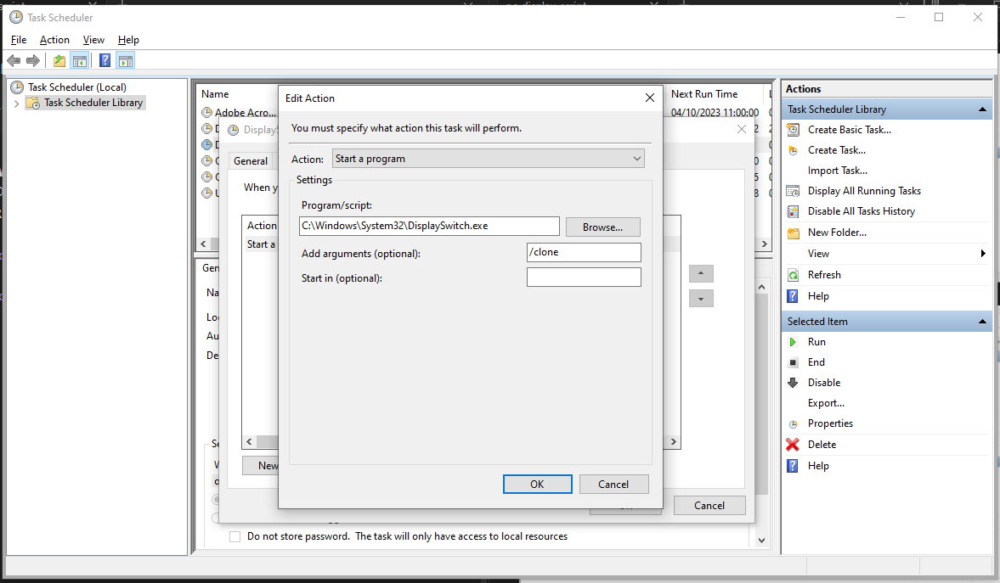

## Windows Task Scheduler
- [ ] Open Windows Task Scheduler
- [ ] Right Click Task Scheduler Library and select "Create Task"
- [ ] Fill in as follows:

---
<figure><figcaption>This is the caption of the image</figcaption></figure><figure>

<figcaption>This is the caption of the image</figcaption>
</figure>

---

[[UC-Engine_IP-Address-Changed]]

![[windows-scheduler-pic2.png | 200]]